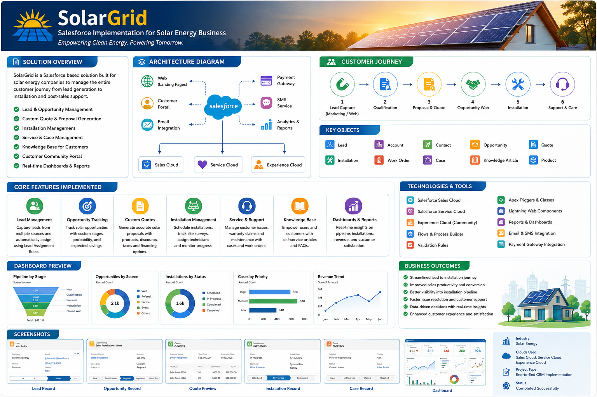
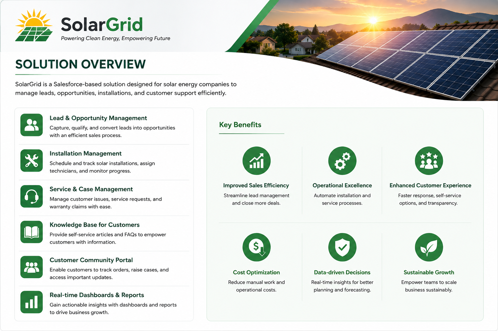
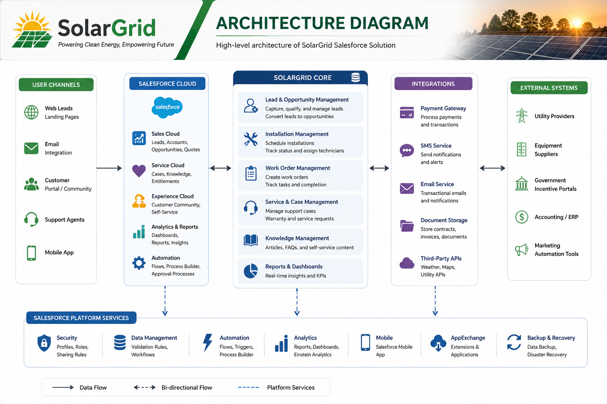
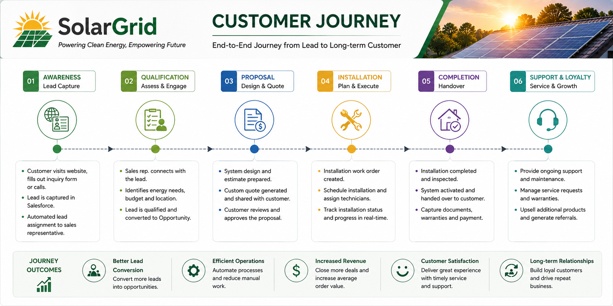
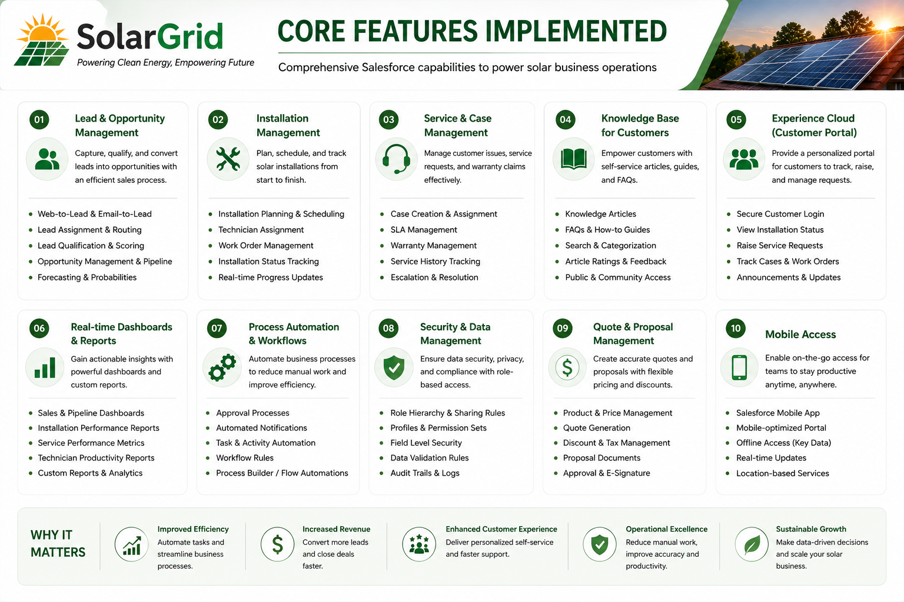

  

# SolarGrid CRM & Customer Support System

### Salesforce Sales Cloud | Service Cloud | Experience Cloud

SolarGrid is an end-to-end Salesforce CRM implementation designed for a renewable energy company specializing in residential and commercial solar installations. The project centralizes customer acquisition, sales operations, installation planning, customer support, and self-service capabilities into a single Salesforce platform.

The implementation combines **Sales Cloud**, **Service Cloud**, and **Experience Cloud** with automation, reporting, and knowledge management to provide a connected customer experience while improving operational efficiency across multiple business departments.

---

# Business Problem

Before Salesforce implementation, sales, installation, and customer support teams relied on disconnected processes including spreadsheets, emails, and manual tracking. Customer information was distributed across multiple systems, making it difficult to monitor sales progress, installation schedules, and ongoing customer support.

These challenges resulted in:

- Manual lead assignment and follow-up
- Limited visibility into the sales pipeline
- Inefficient installation coordination
- Unstructured customer support processes
- Lack of customer self-service
- Limited reporting and operational visibility

SolarGrid was developed to eliminate these challenges by providing a centralized CRM platform capable of managing the complete customer lifecycle.

---

# Solution Overview

  

SolarGrid transforms the complete business workflow into a structured Salesforce solution.

Customer inquiries enter Salesforce as Leads, where automated assignment and qualification processes ensure timely engagement. Qualified prospects progress through Opportunities, proposal approval, installation planning, and finally transition into long-term customer support.

The solution integrates sales operations, customer service, business automation, reporting, and customer self-service into a single scalable CRM platform.

---

# Solution Architecture

  

The implementation follows a multi-cloud Salesforce architecture consisting of:

- **Sales Cloud** for Lead, Account, Contact, Opportunity, Product, and Quote Management.
- **Service Cloud** for Case Management, Knowledge, Queues, Assignment Rules, and Email-to-Case.
- **Experience Cloud** for customer self-service, knowledge access, support requests, and case tracking.
- **Flow Automation** to automate lead assignment, notifications, approvals, and business processes.
- **Reports & Dashboards** providing real-time business insights for management.

This architecture provides a single source of truth for customer information while enabling seamless collaboration between sales, operations, and support teams.

---

# Customer Journey

  

The customer lifecycle implemented within Salesforce follows a structured business process:

**Lead Capture**
→ Customer inquiry received through marketing or website.

**Qualification**
→ Sales team validates customer requirements.

**Proposal & Quote**
→ Solar solution and pricing are prepared.

**Opportunity Won**
→ Customer accepts the proposal.

**Installation**
→ Installation is scheduled and tracked.

**Support & Customer Care**
→ Ongoing warranty support, service requests, and knowledge resources are managed through Salesforce.

---

# Core Features Implemented

  

The implementation includes:

- Lead & Opportunity Management
- Installation Management
- Service & Case Management
- Knowledge Management
- Experience Cloud Customer Portal
- Reports & Dashboards
- Flow Automation
- Security & Access Control
- Quote & Proposal Management
- Mobile Accessibility

Each feature was configured to support real-world business operations while minimizing manual effort through Salesforce automation.

---

# Salesforce Implementation

### Sales Cloud

Implemented a structured sales lifecycle covering Lead Management, Opportunity Tracking, Product Configuration, Price Books, Proposal Approval, Revenue Forecasting, and Installation Planning.

### Service Cloud

Configured Case Management, Support Queues, Assignment Rules, Email-to-Case, Knowledge Articles, and service dashboards to improve customer support efficiency.

### Experience Cloud

Developed a customer portal allowing users to browse Knowledge Articles, submit support requests, monitor cases, and access self-service resources.

### Automation

Business processes were automated using Salesforce Flow, including Lead Assignment, Proposal Notifications, Installation Updates, Approval Processes, and Email Alerts.

### Reporting

Created interactive dashboards for Sales Performance, Revenue Forecasting, Lead Conversion, Installation Progress, and Customer Support metrics, enabling data-driven decision making.

---

# Technologies Used

| Category | Technologies |
|----------|--------------|
| CRM Platform | Salesforce |
| Clouds | Sales Cloud, Service Cloud, Experience Cloud |
| Automation | Salesforce Flow, Assignment Rules |
| Knowledge | Salesforce Knowledge |
| Customer Portal | Experience Cloud |
| Reporting | Reports & Dashboards |
| Security | Profiles, Permission Sets, Sharing Rules, Field-Level Security |

---

# Business Outcomes

The implementation delivers measurable operational improvements across the organization:

- Centralized customer information
- Faster lead assignment and qualification
- Improved opportunity visibility
- Streamlined installation planning
- Structured customer support operations
- Self-service customer portal
- Reduced manual administrative effort
- Real-time business reporting
- Improved collaboration between departments
- Enhanced customer experience

---

# Project Conclusion

SolarGrid demonstrates a complete Salesforce CRM implementation tailored for the renewable energy industry. By combining Sales Cloud, Service Cloud, Experience Cloud, automation, security, and analytics into a unified solution, the platform supports the entire customer journey—from initial inquiry through installation and long-term customer support.

The project showcases practical Salesforce implementation skills across multiple clouds while emphasizing business process optimization, automation, and customer-centric solution design.